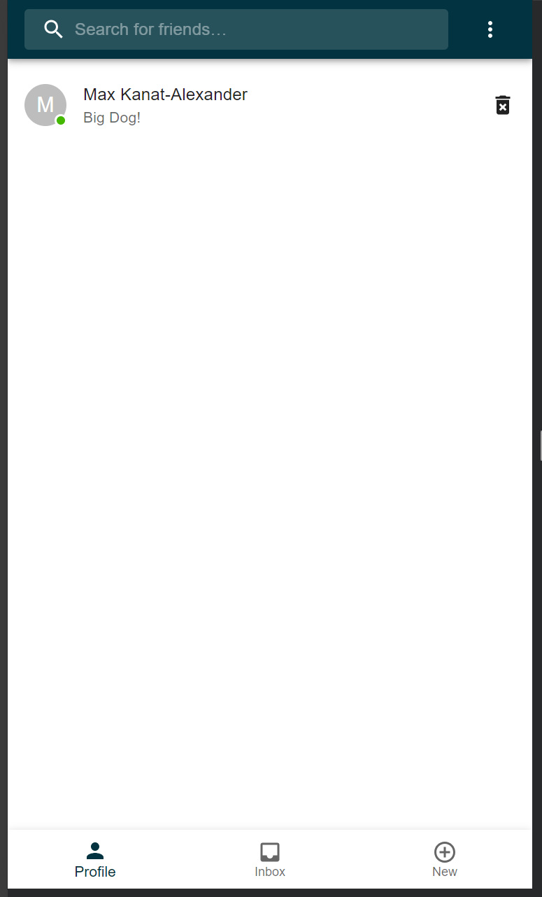
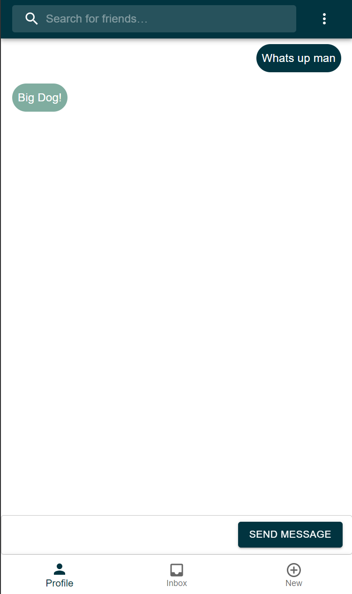
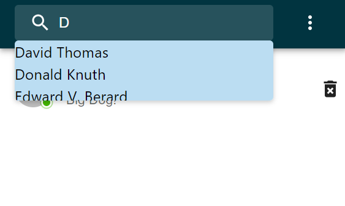

# Messenger
Providing sophistication and security, without sacrificng speed.

## Motivation
- To create an instant messenger application using the MERN stack.
 
## Screenshots

## Tech/framework used

<b>Built with:</b>
- MongoDB
- Express.js
- React
- Node.js
- Apollo GraphQL
- Material UI

<b>Languages used:</b>
 - [HTML]
 - [CSS]
 - [Javascript]
 - [JSX]

## Deployed application link

Deployed application: 

## How to use?
- Upon visiting the application, you will be given the option to sign up / in. From there, you will be routed to your own account page, where you can view your 'inbox' to see ongoign conversations, choose the 'new' option to start a new conversation, as well as a 'profile' tab to view and edit your own profile data. To find new friends to chat with, you can use the search bar at the type to query by username. View their prfile and select the option to send a mesage to start a new conversation there. Avatar's have a badge that indicates wether a user is currently online or not. User's can logout by selecing one of the 'logout' options. 

## Credits

<b>Contributors:</b>

Kevin Hedengren: https://github.com/crockevin
Chris Panelli: https://github.com/Cpanelli
Nic Diaz: https://github.com/nicanthoni
Tyler Girard: https://github.com/Osmilliardo

## License

MIT © [crockevin]()
